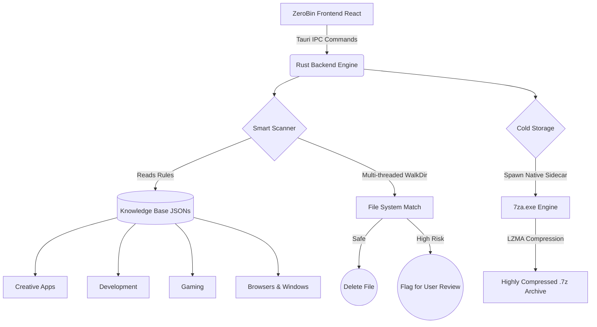

<div align="center">
  
  <h1>ZeroBin</h1>
  <p><strong>A blazingly fast, intelligent PC cleaner and cold-storage archiver powered by Rust.</strong></p>
</div>

---

## ⚡ Why ZeroBin?
Modern operating systems and development tools are notorious for leaving behind gigabytes of hidden caches, obsolete crash dumps, and unoptimized dependencies. Standard cleaning tools are often destructive or rely on outdated heuristics.

**ZeroBin** takes a completely different approach. It uses a **Smart Knowledge Base** that identifies application-specific junk (like dormant `.gradle` caches, `node_modules`, NVIDIA Shaders, or Adobe Media Caches) and safely reclaims your disk space without touching your critical files.

## ✨ Features
* 🦀 **Rust-Powered Engine:** Scans millions of files in milliseconds with non-blocking, multi-threaded I/O operations.
* 🧠 **Smart Knowledge Base:** Uses granular `.json` dictionaries to semantically identify what is safe to delete and what requires user review.
* 📦 **Cold Storage Archival:** Deep integration with the **7-Zip LZMA SDK** via native sidecars to crush large, dormant folders into highly compressed `.7z` archives.
* 🔄 **Over-The-Air (OTA) Updates:** Cryptographically verified background updates ensure you always have the latest cleaning rules.
* 🛡️ **Safe by Design:** ZeroBin operates defensively. It does not touch system-critical Windows files and skips files currently in use to prevent data corruption.
* 🎨 **Stunning UI:** Built with React, TailwindCSS, and Lucide Icons for a premium, dynamic, and glassmorphic user experience.

---

## 🏗️ Architecture Flow

ZeroBin is split into two primary engines: The **Smart Scanner** and the **Cold Storage Archiver**.



## 🚀 Getting Started

### Prerequisites
* [Node.js](https://nodejs.org/) (v18+)
* [Rust](https://rustup.rs/) (latest stable)
* [Tauri CLI](https://tauri.app/v1/guides/getting-started/setup/)

### Local Development
```bash
# 1. Clone the repository
git clone https://github.com/imashu-del/ZeroBin.git

# 2. Install frontend dependencies
npm install

# 3. Start the Vite development server with the Rust backend
npm run tauri dev
```

### Building for Production
To generate a production-ready Windows Installer (`.exe`):
```bash
# You must provide your private key password to sign the OTA update package
$env:TAURI_SIGNING_PRIVATE_KEY_PASSWORD="your-password"
npm run tauri build
```
Your compiled installer will be located in `src-tauri/target/release/bundle/nsis/`.

---

## 🧠 The Knowledge Base
ZeroBin is only as smart as its rules. The `knowledge/` directory contains highly specific JSON files that tell the Rust backend exactly what to look for.

Example rule from `browsers.json`:
```json
{
  "name": "Brave Browser Cache",
  "category": "browsers",
  "safe_to_delete": true,
  "risk": "low",
  "description": "Cached web content for Brave.",
  "path_patterns": [
    "*\\BraveSoftware\\Brave-Browser\\User Data\\*\\Cache\\*"
  ]
}
```
*Anyone can contribute to the Knowledge Base to make ZeroBin smarter!*

---

## ⚖️ License & Legal
ZeroBin's proprietary source code is protected under a custom Source-Available License. 

You are free to download, install, and use ZeroBin for personal or commercial use. However, you may **not** reverse engineer, decompile, modify, or integrate ZeroBin into other software without explicit written permission from the author. 

*ZeroBin securely bundles the 7-Zip standalone command-line executable (`7za.exe`), which is copyright (c) 1999-2023 Igor Pavlov and licensed under the GNU LGPL. For details, see the `LICENSE` file.*

<div align="center">
  <p>Built with 🤍 by <strong>Ashutosh Samanta</strong></p>
</div>
